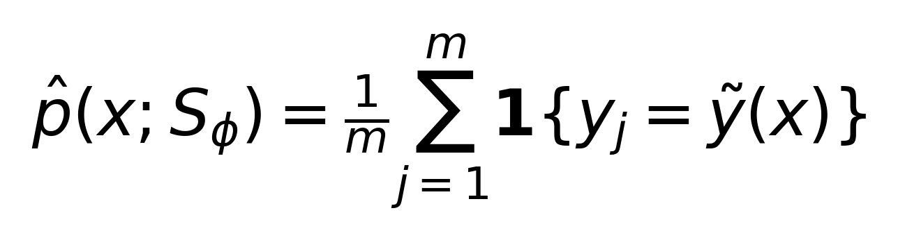
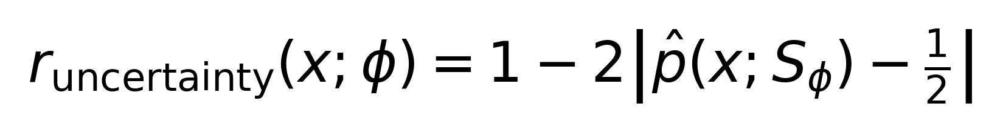
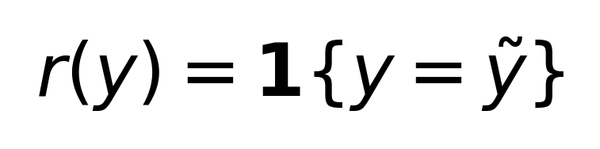
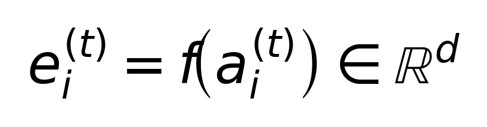
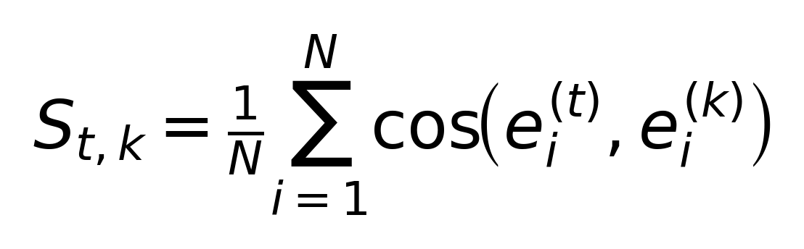
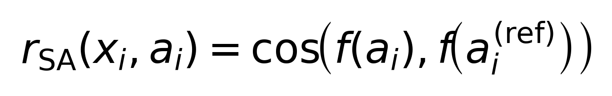
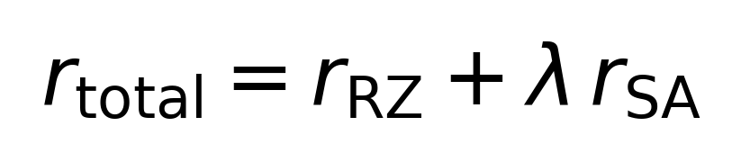

# SA-RZero: Similarity-Regularized Self-Play to Mitigate Iteration Collapse in R-Zero

> **TL;DR**  
> R-Zero는 Challenger–Solver self-play로 외부 데이터 없이 추론 능력을 향상시키지만, iteration이 진행되면 성능이 **상승 후 붕괴(collapse)** 하는 현상이 관찰됩니다.  
> 본 프로젝트는 **세대 간 답변의 semantic similarity(임베딩 cosine similarity)** 를 “self-awareness”의 실용적 프록시로 정의하고, 이를 **auxiliary reward**로 사용해 붕괴를 완화하고 더 긴 iteration에서도 성능을 안정적으로 끌어올립니다.

---

## 1. Background: R-Zero Self-Play (Challenger–Solver)

R-Zero는 단일 base LLM을 두 역할로 분기하여 **Challenger**와 **Solver**가 공동 진화(co-evolution)하도록 설계한 self-play 프레임워크입니다.

- **Challenger**: Solver의 현재 역량 “경계(edge)”에 가까운 문제를 생성하도록 학습  
- **Solver**: Challenger가 만든 문제를 풀며 점진적으로 능력 향상

### 1.1 R-Zero Reward (핵심 요약)

Solver의 self-consistency(다수 답변 중 최빈값 일치율)를 \(\hat{p}\)로 두면:

<p align="center">
  <picture>
    <source srcset="assets/formulas/p_hat.svg" type="image/svg+xml">
    
  </picture>
</p>

R-Zero의 uncertainty reward는 다음 형태로 정의됩니다.

<p align="center">
  <picture>
    <source srcset="assets/formulas/r_uncertainty.svg" type="image/svg+xml">
    
  </picture>
</p>

Solver 학습은 filtered QA set에서 pseudo-label \(\tilde{y}\)와의 일치 여부로 binary reward를 둘 수 있습니다.

<p align="center">
  <picture>
    <source srcset="assets/formulas/r_solver.svg" type="image/svg+xml">
    
  </picture>
</p>

> 참고: R-Zero는 위 구성요소들을 repetition penalty 등과 결합하여 Challenger/Solver를 GRPO로 학습합니다.  
> (상세는 R-Zero 원문/코드를 참고)

---

## 2. Motivation: Iteration Collapse in Self-Generated Loops

R-Zero 스타일 self-play는 초기 iteration에서 성능이 상승하지만, iteration이 늘어나면 특정 시점 이후 **성능 저하/붕괴(collapse)** 가 관찰될 수 있습니다.

반복 self-play에서 다음과 같은 불안정성이 생길 수 있습니다.

- pseudo-label 품질 저하 및 feedback loop
- 분포 다양성 감소 / 특정 패턴으로의 수렴
- 이전에 획득한 풀이 전략의 drift 및 forgetting

우리는 이 불안정성을 줄이기 위해, “세대 간 semantic drift”를 측정 가능한 신호로 만들고 그 신호를 학습에 다시 피드백합니다.

---

## 3. Our Method: Self-Awareness via Inter-Generation Semantic Similarity

### 3.1 Self-Awareness Proxy (정의)

철학적 의미의 self-awareness를 직접 정의하기보다, 반복 학습에서 중요한 실용적 질문으로 치환합니다.

> “모델이 이미 풀어본(=자신이 확신을 가졌던) 문제에 대해, 세대가 바뀌어도 의미적으로 일관된 답변을 유지하는가?”

이를 위해 **anchor set** \(\mathcal{A}=\{x_i\}_{i=1}^{N}\) (이미 푼 문제들)을 구성합니다.

각 세대 \(t\)의 모델이 anchor 문제 \(x_i\)에 대해 생성한 답변을 \(a_i^{(t)}\)라고 하고, 텍스트 임베딩 함수 \(f(\cdot)\)로 다음을 계산합니다.

<p align="center">
  <picture>
    <source srcset="assets/formulas/embed_def.svg" type="image/svg+xml">
    
  </picture>
</p>

cosine similarity는:

<p align="center">
  <picture>
    <source srcset="assets/formulas/cos_def.svg" type="image/svg+xml">
    
  </picture>
</p>

두 세대 \(t,k\)의 평균 유사도는:

<p align="center">
  <picture>
    <source srcset="assets/formulas/S_tk.svg" type="image/svg+xml">
    
  </picture>
</p>

이 \(S_{t,k}\)는 세대 간 “semantic footprint” 유사도를 나타내며, 학습이 불안정해지면 drift가 커질 수 있습니다.

---

### 3.2 Similarity Reward (학습 신호)

R-Zero의 Solver 학습은 기본적으로 “pseudo-label과의 일치”로 reward를 구성합니다.  
우리는 여기에 **semantic consistency** 항을 추가합니다.

reference(기준) 답변을 \(a_i^{(\mathrm{ref})}\)로 두고, 현재 답변 \(a_i\)에 대해 self-awareness reward를:

<p align="center">
  <picture>
    <source srcset="assets/formulas/r_SA.svg" type="image/svg+xml">
    
  </picture>
</p>

최종 Solver reward는:

<p align="center">
  <picture>
    <source srcset="assets/formulas/r_total.svg" type="image/svg+xml">
    
  </picture>
</p>

- \(r_{\mathrm{RZ}}\): R-Zero의 기존 solver reward (예: pseudo-label과 exact match인 경우 1, 아니면 0)
- \(r_{\mathrm{SA}}\): 세대 간 의미적 일관성을 보상하는 항
- \(\lambda\): self-awareness reward 가중치

**직관**
- \(r_{\mathrm{RZ}}\)는 “현재 생성된 curriculum에서 정답(또는 pseudo-label)을 맞추는 능력”을 올리고,
- \(r_{\mathrm{SA}}\)는 “이미 풀었던 문제에서 세대가 바뀌어도 의미적 일관성을 유지”하도록 regularize하여,
  반복 self-play에서 drift/degeneration을 완화합니다.

---

### 3.3 Prompting-only Baseline

- **Ours (prompting based)**: 프롬프트 개선(질문 생성/해답 형식 유도, 필터 기준 보정 등)만 적용. Similarity reward는 미사용.
- **Ours**: prompting 개선 + similarity reward까지 포함한 전체 방법.

---

## 4. Experimental Results

### 4.1 Main Results

아래는 iteration별 성능(%) 비교입니다. (Higher is better)

| Model | R-Zero | Ours (prompting based) | Ours |
|---|---:|---:|---:|
| BASE | 50.15 | 50.15 | 50.15 |
| V1 | 54.74 | 52.47 | 53.21 |
| V2 | 54.64 | 53.91 | 54.52 |
| V3 | 54.61 | 53.75 | 55.01 |
| V4 | 54.21 | 54.12 | 55.47 |
| V5 | 53.58 | 54.36 | **56.22** |

**Key takeaways**
- R-Zero는 V1에서 최고점(54.74)을 찍은 뒤 iteration이 진행되며 하락(V5=53.58).
- prompting-only도 어느 정도 개선을 보이지만,
  **Similarity Reward를 결합한 Ours가 V5까지 지속적으로 상승**.
- 최종(V5) 기준:
  - Ours vs R-Zero: **+2.64p**
  - Ours vs prompting-only: **+1.86p**

---

### 4.2 Self-Awareness (Similarity) Analysis

Anchor 문제들에 대해 세대별 답변 임베딩 cosine similarity를 측정한 결과(예시)는 다음과 같습니다.

> NOTE  
> cosine similarity matrix는 원칙적으로 대칭이어야 하므로, 비대칭 값이 있다면  
> (1) 측정 샘플/방식 차이, (2) 로그/표 작성 과정의 typo 가능성을 점검하세요.

|  | BASE | V1 | V2 | V3 | V4 | V5 |
|---|---:|---:|---:|---:|---:|---:|
| **BASE** | 1.0000 | 0.9851 | 0.8867 | 0.8867 | 0.8848 | 0.9219 |
| **V1** | 0.9851 | 1.0000 | 0.9024 | 0.9024 | 0.9004 | 0.9199 |
| **V2** | 0.8867 | 0.9024 | 1.0000 | 1.0000 | 0.9987 | 0.8509 |
| **V3** | 0.8867 | 0.9803 | 1.0000 | 1.0000 | 0.9987 | 0.8509 |
| **V4** | 0.8848 | 0.9004 | 0.9987 | 0.9987 | 1.0000 | 0.8489 |
| **V5** | 0.9219 | 0.9199 | 0.8509 | 0.8509 | 0.8489 | 1.0000 |

**Observed pattern**
- 인접 세대끼리 semantic similarity가 높게 유지되는 구간이 존재하며,
- 특정 iteration 이후 세대 간 “semantic drift”가 커지는 징후를 포착할 수 있습니다.
- 우리는 이 drift를 학습 중 reward signal로 사용해 안정성을 강화했습니다.

---

## 5. Algorithm (Pseudo-code)

```text
Algorithm: Similarity-Regularized R-Zero (Solver-side)

Input:
  Base model M0
  Iterations T
  Anchor buffer A (solved problems from previous iterations)
  Embedding encoder f(·)
  Weight λ

Initialize:
  Challenger Q0 ← M0
  Solver S0 ← M0

for t = 1..T:
  (1) Train Challenger as in R-Zero (uncertainty-based reward)
      Qt ← GRPO_train_challenger(Qt-1, frozen_solver=St-1)

  (2) Generate candidate questions and build filtered training set Dt
      Dt ← build_dataset_with_majority_vote_and_filtering(Qt, St-1)

  (3) Train Solver with combined reward
      for each question x in Dt:
          y_ref ← reference_answer_from_anchor(A, x)   # e.g., previous solver’s answer
          sample answers y ~ St-1(·|x)
          r_RZ ← 1[y == pseudo_label(x)]
          r_SA ← cos( f(y), f(y_ref) )
          r_total ← r_RZ + λ r_SA
      St ← GRPO_train_solver(St-1, Dt, reward=r_total)

  (4) Update anchor buffer (optional)
      A ← update_anchor(A, St, criteria=high_consistency)

return ST
```

---

## 6. Practical Notes

### 6.1 Anchor set \(\mathcal{A}\)
- “이미 푼 문제”를 anchor로 쓸 때는 **정답 가능성이 높은 샘플**만 포함시키는 것이 중요합니다.
  - 예: self-consistency가 높은 샘플
  - 예: 다수결 pseudo-label 신뢰도가 높은 샘플

### 6.2 Embedding model \(f(\cdot)\)
- drift를 잘 포착하고 계산 비용이 과하지 않은 임베딩 모델을 선택하는 것이 중요합니다.
  - 예: SBERT / E5 등 sentence embedding 계열

### 6.3 Limitations
- reference answer 자체가 잘못되면 similarity reward가 “틀린 답을 고정”할 위험이 있습니다.
  - 해결: anchor selection을 더 엄격히, 혹은 teacher ensemble 사용
- similarity를 너무 강하게 주면 “새로운 능력 획득”이 억제될 수 있습니다.
  - 해결: \(\lambda\) 스케줄링, difficulty별 \(\lambda\) 차등 적용 등

---

## 7. References

- R-Zero (arXiv): https://arxiv.org/abs/2508.05004  
- R-Zero (GitHub): https://github.com/Chengsong-Huang/R-Zero

### BibTeX (R-Zero)

```bibtex
@misc{huang2025rzero,
  title={R-Zero: Self-Evolving Reasoning LLM from Zero Data},
  author={Chengsong Huang and Wenhao Yu and Xiaoyang Wang and Hongming Zhang and Zongxia Li and Ruosen Li and Jiaxin Huang and Haitao Mi and Dong Yu},
  year={2025},
  eprint={2508.05004},
  archivePrefix={arXiv},
  primaryClass={cs.LG}
}
```

### BibTeX (This work; template)

```bibtex
@misc{yourname2026sarzero,
  title={SA-RZero: Similarity-Regularized Self-Play to Mitigate Iteration Collapse in R-Zero},
  author={YOUR NAME(S)},
  year={2026},
  note={GitHub repository / technical report}
}
```
